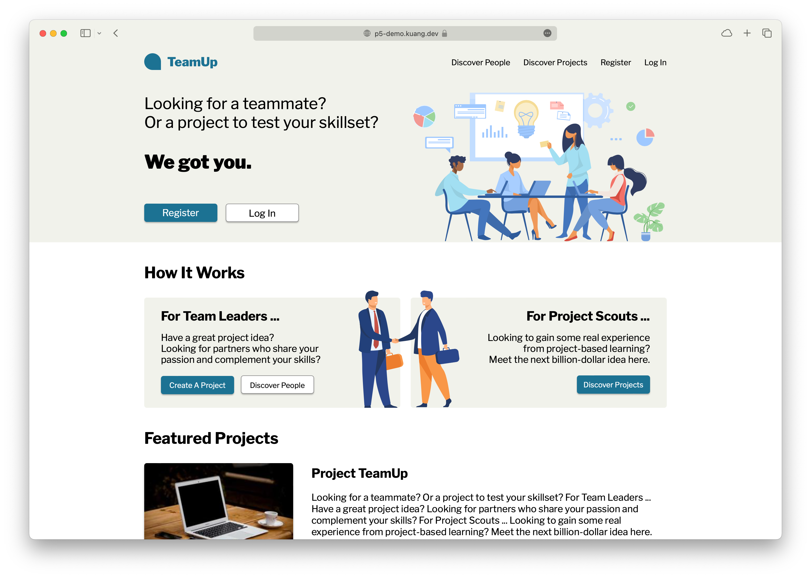

# Project TeamUp

Class project from Su21 Web Dev.

Tech stack for this project:

- front-end: HTML, CSS, JavaScript and Vue.js
- back-end: PHP and MySQL
- UI design: Figma (design doc: https://bit.ly/project-teamup-design)

This website used to run on UTCS machines. Unfortunately UTCS stopped hosting it. So I **dockerized** it and it's running on my 1GB-RAM server in Los Angeles right now. You might expect to experience performance issues since the server is also running some other apps of mine.

## Test Account

User: `test@kuang.dev` \
Password: `Test2023`

## Limitations

- Not professional in UI/UX
- Unfinished parts: Discover People and search feature
- Only works on computers (not responsive for mobile users)
- Front-end code not bundled and optimized
